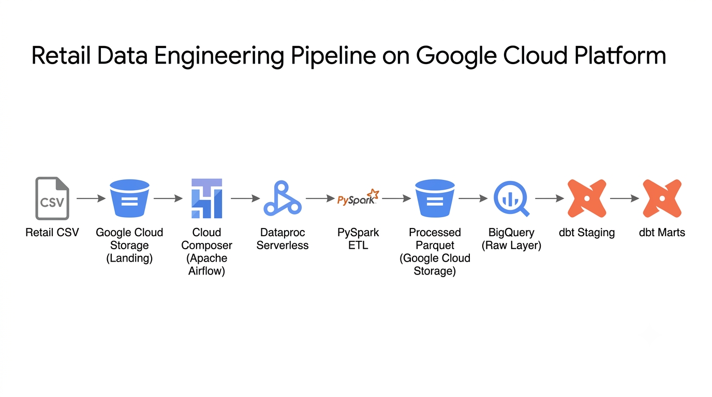
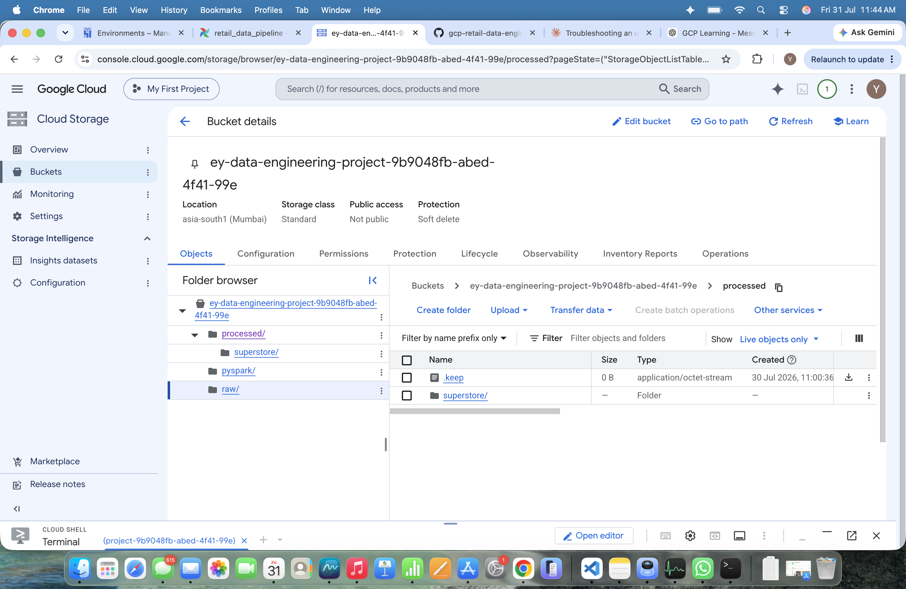
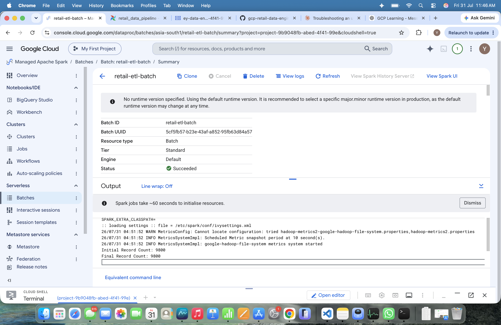
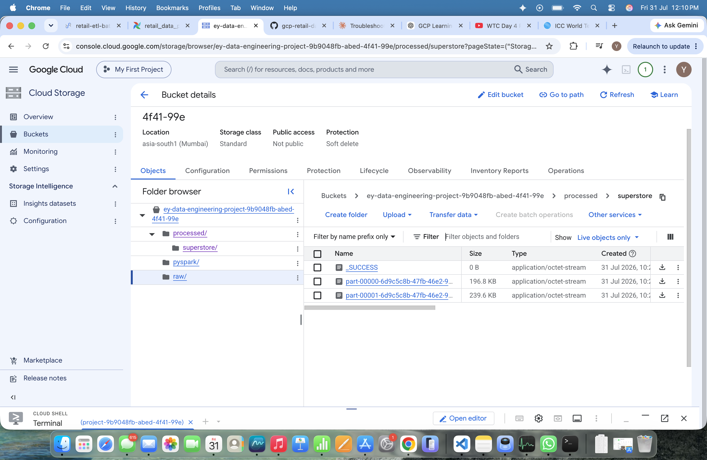
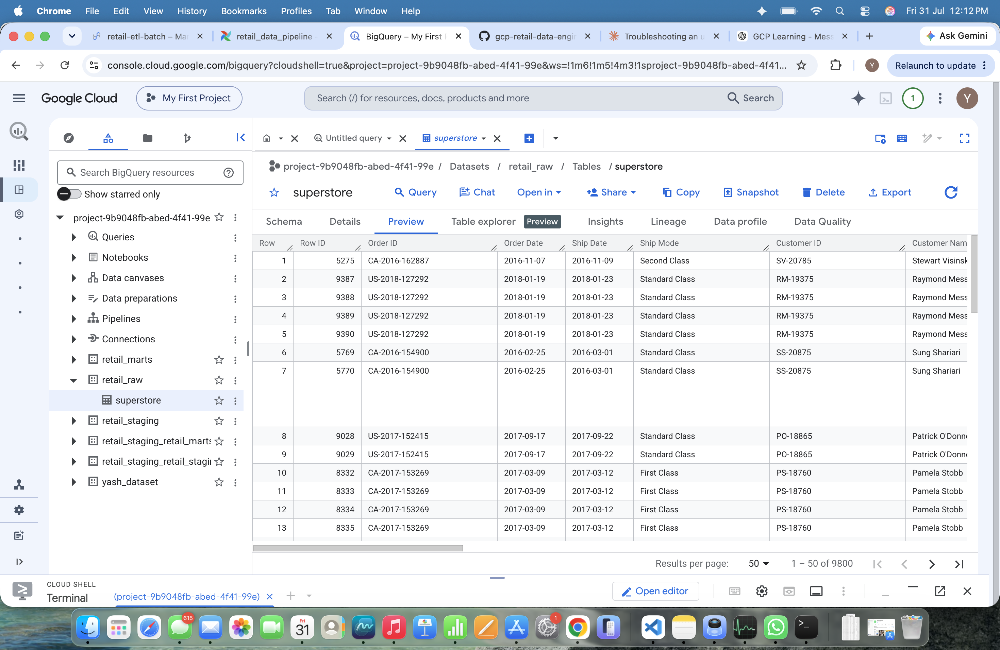
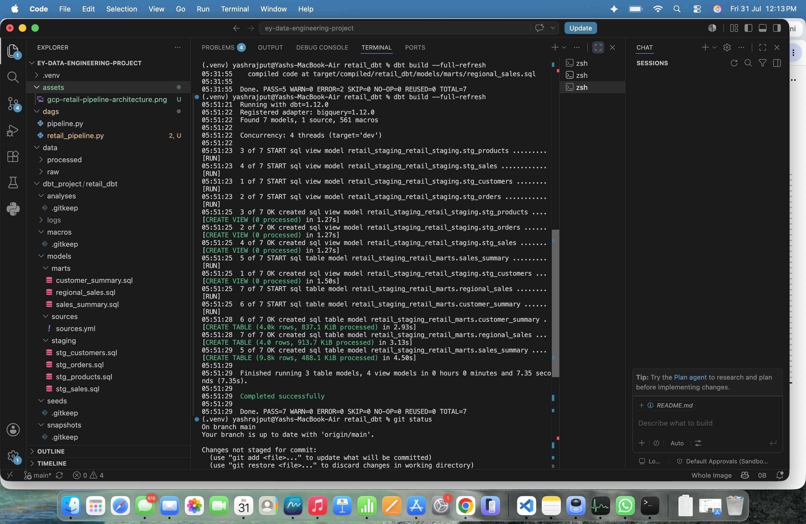
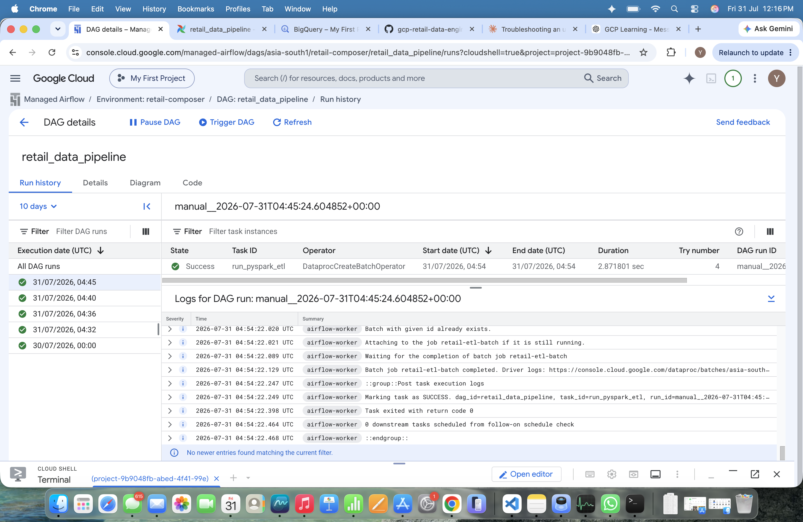
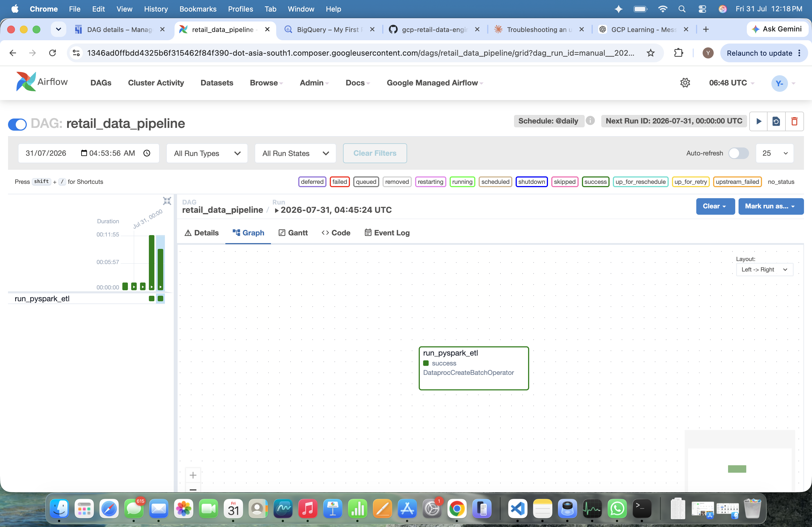

# 🚀 Retail Data Engineering Pipeline on Google Cloud Platform

<p align="center">


</p>

---

## 📌 Project Overview

Modern organizations generate massive volumes of transactional data every day. Transforming this raw data into reliable, analytics-ready datasets requires scalable processing, automated orchestration, and well-designed cloud architecture.

This project demonstrates a **production-style Retail Data Engineering Pipeline** built entirely on **Google Cloud Platform (GCP)**. It simulates a real-world cloud data platform by ingesting raw retail sales data, processing it using distributed PySpark jobs, loading it into a cloud data warehouse, transforming it through layered data models, and orchestrating the entire workflow using Apache Airflow.

The pipeline consists of:

- **Google Cloud Storage** as the landing and processed storage layer
- **Dataproc Serverless** for distributed PySpark ETL processing
- **BigQuery** as the analytical data warehouse
- **dbt Core** for layered SQL transformations
- **Cloud Composer (Apache Airflow)** for workflow orchestration

The project follows production engineering principles including modular design, idempotent processing, reproducible workflows, layered transformations, and clean repository organization.

---

# ⭐ Project Highlights

- ✅ End-to-End Cloud Data Engineering Pipeline
- ✅ Google Cloud Storage Landing & Processed Storage
- ✅ Dataproc Serverless PySpark ETL
- ✅ Distributed Data Processing
- ✅ BigQuery Data Warehouse
- ✅ Layered dbt Transformations
- ✅ Apache Airflow Orchestration
- ✅ Production-Oriented Repository Structure
- ✅ Cloud-Native Architecture
- ✅ Portfolio-Ready Documentation

---

# 🏗 Architecture

<p align="center">

</p>

---

# ⚙️ Technology Stack

| Layer | Technology |
|--------|------------|
| Cloud Platform | Google Cloud Platform |
| Object Storage | Google Cloud Storage |
| Distributed Processing | Dataproc Serverless |
| ETL Framework | Apache Spark (PySpark) |
| Data Warehouse | BigQuery |
| Data Transformation | dbt Core |
| Workflow Orchestration | Cloud Composer (Apache Airflow) |
| Programming Language | Python |
| Version Control | Git & GitHub |
| Development Environment | VS Code |

---

# 📂 Repository Structure

```text
ey-data-engineering-project/

├── dags/
│   └── retail_pipeline.py
│
├── pyspark/
│   └── etl.py
│
├── dbt_project/
│   └── retail_dbt/
│       ├── models/
│       │   ├── sources/
│       │   ├── staging/
│       │   └── marts/
│       ├── snapshots/
│       ├── tests/
│       └── dbt_project.yml
│
├── data/
│   ├── raw/
│   └── processed/
│
├── screenshots/
│   ├── architecture.png
│   ├── 01-gcs-bucket.png
│   ├── 02-dataproc-batch-success.png
│   ├── 03-parquet-output.png
│   ├── 04-bigquery-raw-table.png
│   ├── 05-dbt-build-success.png
│   ├── 06-composer-dag-success.png
│   └── 07-composer-graph-view.png
│
├── docs/
│
├── requirements.txt
│
└── README.md
```

---

# 📊 End-to-End Pipeline Workflow

The pipeline follows a modern ELT architecture where raw retail data passes through multiple cloud services before becoming analytics-ready.

```text
Retail CSV
      │
      ▼
Google Cloud Storage
      │
      ▼
Cloud Composer (Apache Airflow)
      │
      ▼
Dataproc Serverless
      │
      ▼
PySpark ETL
      │
      ▼
Processed Parquet
      │
      ▼
BigQuery Raw
      │
      ▼
dbt Staging
      │
      ▼
dbt Marts
```

---

# 1️⃣ Data Ingestion

The pipeline begins by ingesting raw retail sales data into **Google Cloud Storage**, which serves as the landing layer for incoming datasets.

**Input File**

```text
raw/superstore.csv
```

The landing layer remains immutable, ensuring reproducibility, traceability, and auditability of the original dataset.

<p align="center">

</p>

---

# 2️⃣ Distributed ETL using PySpark

A **Dataproc Serverless** batch executes the PySpark ETL pipeline, enabling scalable distributed processing without provisioning Spark clusters.

The ETL pipeline performs:

- Schema inference
- Duplicate removal
- Missing value handling
- Data validation
- Date conversion
- Data cleansing
- Compressed Parquet generation

The transformed dataset is written back to **Google Cloud Storage** in Parquet format.

**Output Location**

```text
processed/superstore/
```

### Dataproc Serverless Batch Execution

<p align="center">

</p>

### Generated Parquet Output

<p align="center">

</p>

---

# 3️⃣ BigQuery Raw Layer

The processed Parquet files are loaded into **BigQuery**, where they form the centralized analytical data warehouse for downstream transformations.

**Dataset**

```text
retail_raw
```

**Table**

```text
superstore
```

BigQuery provides scalable storage and high-performance SQL analytics for large datasets.

<p align="center">

</p>

---

# 4️⃣ Data Transformation using dbt

The raw data is transformed into analytics-ready datasets using **dbt (Data Build Tool)** following a layered data modeling approach.

## Staging Layer

The staging layer standardizes and cleanses the raw BigQuery tables before downstream transformations.

Models include:

- `stg_sales`
- `stg_orders`
- `stg_customers`
- `stg_products`

---

## Mart Layer

The marts layer contains business-ready analytical datasets optimized for reporting and decision-making.

Models include:

- `sales_summary`
- `customer_summary`
- `regional_sales`

This layered architecture improves maintainability, reusability, and scalability while separating raw data from business logic.

<p align="center">

</p>

---

# 5️⃣ Workflow Orchestration using Apache Airflow

The complete ETL workflow is orchestrated using **Cloud Composer (Apache Airflow)**.

Airflow automates pipeline execution by submitting a **Dataproc Serverless** batch through the `DataprocCreateBatchOperator`, eliminating manual execution and enabling scheduled workflows.

### Responsibilities of Airflow

- Trigger the PySpark ETL pipeline
- Manage task dependencies
- Submit Dataproc Serverless batches
- Monitor pipeline execution
- Provide centralized workflow visibility

### DAG Execution

<p align="center">

</p>

### Airflow Graph View

<p align="center">

</p>

---

# ✅ End-to-End Pipeline Validation

Each layer of the pipeline was validated independently to ensure successful execution from data ingestion through analytical model generation.

| Pipeline Stage | Status |
|----------------|--------|
| Retail CSV Uploaded to GCS | ✅ |
| Dataproc Serverless Batch Executed | ✅ |
| PySpark ETL Completed | ✅ |
| Parquet Files Generated | ✅ |
| BigQuery Raw Table Loaded | ✅ |
| dbt Staging Models Built | ✅ |
| dbt Mart Models Built | ✅ |
| Cloud Composer DAG Executed | ✅ |
| End-to-End Pipeline Validated | ✅ |

---

# 📈 Skills Demonstrated

This project demonstrates practical experience with:

### Cloud Platforms

- Google Cloud Platform (GCP)
- Google Cloud Storage
- Dataproc Serverless
- BigQuery
- Cloud Composer

### Data Engineering

- Distributed Data Processing
- PySpark ETL Development
- Cloud Data Warehousing
- ELT Pipeline Design
- Data Modeling using dbt
- Workflow Orchestration
- Batch Processing

### Software Engineering

- Python
- SQL
- Git & GitHub
- Production Repository Organization
- Cloud Debugging & Troubleshooting
- Modular Project Design

---

# 📚 Key Learnings

During this project I gained hands-on experience with:

- Designing production-style cloud data engineering architectures
- Building scalable ETL pipelines using Apache Spark
- Processing large datasets with Dataproc Serverless
- Loading and querying analytical data in BigQuery
- Developing layered transformations using dbt
- Orchestrating cloud workflows using Apache Airflow
- Debugging real-world cloud infrastructure issues
- Applying production engineering best practices to repository organization

---

# 🚀 Future Enhancements

Potential improvements include:

- Interactive Looker Studio dashboards
- Incremental dbt models
- Automated dbt tests
- Great Expectations data quality validation
- BigQuery partitioning and clustering
- Cloud Monitoring dashboards
- GitHub Actions CI/CD
- Terraform infrastructure provisioning
- Pub/Sub streaming ingestion
- Docker-based local development environment

---

# 📖 Documentation

Additional documentation is available inside the **docs/** directory.

Documentation includes:

- Architecture Overview
- Project Setup Guide
- Pipeline Workflow
- Troubleshooting Guide
- Lessons Learned

---

# 👨‍💻 Author

## Yash Rajput

**B.Tech Information Technology**
Maharaja Agrasen Institute of Technology (MAIT), Delhi

Aspiring Data Engineer | Google Cloud | Big Data | Data Engineering

### Connect with Me

GitHub
https://github.com/yash06rajput

LinkedIn
https://www.linkedin.com/in/yashrajput06/

---

# 🤝 Contributing

Contributions, suggestions, and feedback are welcome.

If you discover an issue or have ideas for improving the project, feel free to open an issue or submit a pull request.

---

# 📄 License

This project is licensed under the **MIT License**.

It is intended for educational purposes, hands-on learning, and portfolio demonstration.